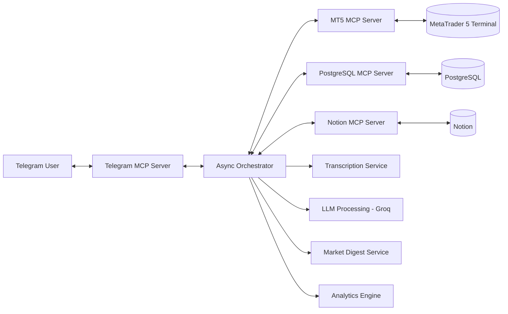
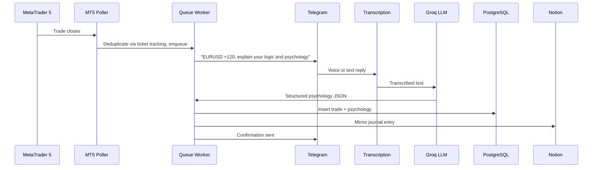

# Trading Buddy AI

**An autonomous AI agent that journals your MetaTrader 5 trades for you, straight through Telegram.**

Close a trade. Speak your reasoning into a voice note. Everything else, transcription, psychology extraction, database storage, and analytics, happens automatically.

---

## Table of Contents

- [TL;DR](#tldr)
- [The Problem](#the-problem)
- [How It Works](#how-it-works)
- [Features](#features)
- [Architecture](#architecture)
- [Project Structure](#project-structure)
- [Trade Journaling Flow](#trade-journaling-flow)
- [Database Schema](#database-schema)
- [Tech Stack](#tech-stack)
- [Getting Started](#getting-started)
- [Usage](#usage)
- [Key Design Decisions](#key-design-decisions)
- [Engineering Notes & Known Limitations](#engineering-notes--known-limitations)
- [Roadmap](#roadmap)
- [Project Status](#project-status)
- [License](#license)
- [Author](#author)

---

## TL;DR

An AI agent that automatically journals your MetaTrader 5 trades via Telegram voice input, extracts structured trading psychology using an LLM, and stores everything in PostgreSQL and Notion, with natural language analytics and on-demand market and news summaries on top.

---

## The Problem

Journaling is one of the highest-leverage habits a trader can build, and also one of the easiest to abandon. After a frustrating session, manually logging instrument, direction, entry, exit, and P&L is the last thing anyone wants to do. The result is either skipped entries or incomplete notes in a spreadsheet that never get revisited. Add in the occasional missed high-impact news event, and small gaps compound into genuinely poor decisions over time.

Trading Buddy AI removes the friction entirely rather than trying to force discipline. The system does the detecting, prompting, transcribing, and storing. The only thing left for the trader to do is talk.

---

## How It Works

When a trade closes in MT5, the system:

- Detects it in real time
- Prompts the trader via Telegram
- Accepts voice or text input
- Transcribes and extracts trading psychology using an LLM
- Stores the result for both human review and structured analytics

No spreadsheets. No manual logging. No missed trades.

---

## Features

### Automated Trade Journaling
- Real-time MT5 trade detection, around 5 second latency
- Telegram prompt sent the moment a trade closes
- Voice or text input, whichever is faster in the moment
- Zero manual data entry

### AI-Powered Psychology Extraction
- Voice converted to text locally via faster-whisper, no API calls, no latency, no data leaving the machine
- LLM extracts structured fields from free-form reasoning:
  - HTF bias
  - Trade logic
  - Confluences
  - Psychology during and after the trade
  - Mistakes and learnings

### Natural Language Analytics
Ask questions directly in Telegram, in plain English:
- "What's my win rate when I felt impatient?"
- "Total profit for EURUSD last month?"
- "How many trades did I win this week?"

Pipeline: natural language → generated SQL → execution against a read-only role → formatted response.

### On-Demand Market & News Digest
- Triggered with `/digest`
- Aggregates the economic calendar (Forex Factory) and the latest forex news (Finnhub)
- LLM generates a concise, actionable briefing
- High-impact events are surfaced separately
- Fully on-demand, no scheduled spam

---

## Architecture



Each integration runs as an isolated MCP server. The orchestrator never talks to MetaTrader 5, Postgres, or Notion directly, it calls tools exposed by the relevant MCP server instead. This keeps every external dependency swappable without touching the core logic.

| Server | Responsibility |
|---|---|
| Telegram MCP | Messaging and update polling |
| MT5 MCP | Trade and account data |
| PostgreSQL MCP | Data storage and queries |
| Notion MCP | Journal visualization |

---

## Project Structure

```
Trading-Buddy-AI-Assistant/
├── src/
│   ├── main.py                  # Entrypoint, launches the orchestrator
│   ├── agent/
│   │   └── orchestrator.py      # Core coordinator: MCP clients, state, message routing, persistence
│   ├── services/
│   │   ├── mt5_poller.py        # Polls MT5 for closed trades, deduplicates, queues them
│   │   ├── queue_worker.py      # Drains the queue, manages the journaling conversation
│   │   ├── voice.py             # Telegram voice download + local Whisper transcription
│   │   ├── psychology.py        # LLM extraction of structured psychology fields
│   │   ├── digest.py            # Pulls economic calendar + forex news, generates LLM summary
│   │   └── analytics.py         # Natural language → SQL → execution → response
│   ├── mcp_servers/
│   │   ├── telegram_mcp.py      # send_message, poll_updates, offset persistence
│   │   ├── postgresql_mcp.py    # insert_trade with field coercion
│   │   ├── mt5_mcp.py           # MT5 wrappers: balance, closed trades, open positions
│   │   └── notion_mcp.py        # create_journal_page, maps trade fields to Notion DB
│   └── utils/
│       └── helpers.py           # Ticket persistence, field cleanup, UTC to IST conversion
├── requirements.txt
├── .env.example
└── README.md
```
Note: The scripts folder contains just code that was used for testing and building the project, and is not needed for the working of the project

---

## Trade Journaling Flow



---

## Database Schema

```sql
CREATE TABLE trades (
    id VARCHAR PRIMARY KEY,
    trade_date DATE,
    asset VARCHAR,
    direction VARCHAR,
    lot_size FLOAT,
    entry_price FLOAT,
    exit_price FLOAT,
    profit_loss FLOAT,
    htf_bias VARCHAR,
    trade_logic TEXT,
    confluences VARCHAR,
    psychology_during VARCHAR,
    psychology_after VARCHAR,
    mistake VARCHAR,
    learning TEXT,
    created_at TIMESTAMP DEFAULT NOW()
);
```

---

## Tech Stack

| Layer | Technology |
|---|---|
| Language | Python |
| Orchestration | asyncio |
| LLM | Groq (LLaMA models) |
| Transcription | faster-whisper (local, CPU) |
| Trading Platform | MetaTrader 5 (Python API) |
| Architecture | MCP (Model Context Protocol) |
| Messaging | Telegram Bot API |
| Database | PostgreSQL |
| Knowledge Mirror | Notion API |
| External APIs | Finnhub, Forex Factory |
| HTTP Client | httpx |

---

## Getting Started

### Requirements
- Windows (required for the MT5 Python API)
- MetaTrader 5 terminal running
- Python 3.11+
- PostgreSQL
- Telegram bot credentials

### Installation

```bash
git clone https://github.com/mhdshabeer/Trading-Buddy-AI-Assistant.git
cd Trading-Buddy-AI-Assistant
pip install -r requirements.txt
cp .env.example .env
```

### Environment Variables

```
GROQ_API_KEY=
mt5_ID=
mt5_PASSWORD=
TELEGRAM_BOT_TOKEN=
TELEGRAM_CHAT_ID=
FINNHUB_API_KEY=
POSTGRES_HOST=
POSTGRES_PORT=
POSTGRES_DB=
POSTGRES_USER=
POSTGRES_PASSWORD=
NOTION_API_KEY=
NOTION_DATABASE_ID=
```

### Run

```bash
python src/main.py
```

---

## Usage

| Command | Description |
|---|---|
| `/digest` | Market and news summary |
| `/skip` | Skip the current trade |
| Any question | Triggers a natural language analytics query |
| Voice note | Used for journaling the current trade |

---

## Key Design Decisions

- **No LLM in the polling loop.** Polling only collects trade events, the LLM is invoked only when there is an actual decision to make. This avoids unnecessary computation and keeps the bot from responding to messages it was never meant to see.
- **Local transcription.** Voice notes are transcribed on-device with faster-whisper, zero API cost, lower latency, and nothing leaves the machine.
- **Queue-based journaling.** Trades are processed one at a time through a queue, preventing overlapping journal prompts when multiple trades close in quick succession.
- **Dual storage.** PostgreSQL for structured analytics, Notion for a human-readable journal. Each serves a different purpose rather than duplicating the same one.
- **Persistent trade tracking.** Processed ticket IDs and the Telegram update offset are both persisted to disk, so a restart never replays old trades or old messages.
- **MCP over plain function calls.** Everything here runs in a single process, so direct function calls between the orchestrator and each integration would have worked fine and added less overhead. MCP was used anyway, on purpose, because the goal of this project was to actually build and understand a modular, tool-calling agent architecture rather than take the shortest path to a working bot.
- **PostgreSQL over SQLite.** For a single-user local journal, SQLite would have been the lighter, more obvious choice, no server process, no connection management. PostgreSQL was chosen instead to get hands-on with a real relational database: roles and permissions (used directly for the read-only analytics role), proper typed columns, and a setup that carries over cleanly if the system ever needs concurrent access or moves to the cloud.

---

## Engineering Notes & Known Limitations

This project optimizes for working software first, and is upfront about the tradeoffs that come with that.

**Already hardened:**
- The analytics path is restricted to SELECT-only queries, runs against a read-only database role, and blocks dangerous keywords before execution. The model never gets write access to the database.
- Blocking calls (the Groq client, Whisper transcription) run off the main event loop, so a single slow transcription can't stall the rest of the bot.
- Ticket and update-offset persistence no longer depends on the process's working directory.

**Still in progress:**
- `orchestrator.py` currently owns message routing, state management, and persistence decisions in one file. Splitting it into a `CommandHandler`, `MessageRouter`, and `TradeJournalFlow` is the next refactor.
- Trade and psychology data are passed around as plain dictionaries rather than typed models (dataclasses or Pydantic).
- No automated test suite yet for trade deduplication, message routing, or the analytics SQL guardrails.
- No graceful shutdown or cancellation strategy for the background polling tasks, the process is currently just stopped.

---

## Roadmap

- [ ] Typed domain models for trades, psychology entries, and complete journal entries
- [ ] Test suite covering dedupe logic, message routing, and analytics SQL constraints
- [ ] Split the orchestrator into smaller, single-responsibility components
- [ ] Docker containerization
- [ ] Cloud deployment (AWS EC2)

---

## Project Status

Core system fully functional:

- [x] Trade detection
- [x] Voice journaling
- [x] Psychology extraction
- [x] PostgreSQL + Notion storage
- [x] Natural language analytics
- [x] Market and news digest

Built and tested against real MT5 trades, live Telegram interactions, and a live PostgreSQL database.

---

## License

MIT License

---

## Author

**Mohammed Shabeer**
